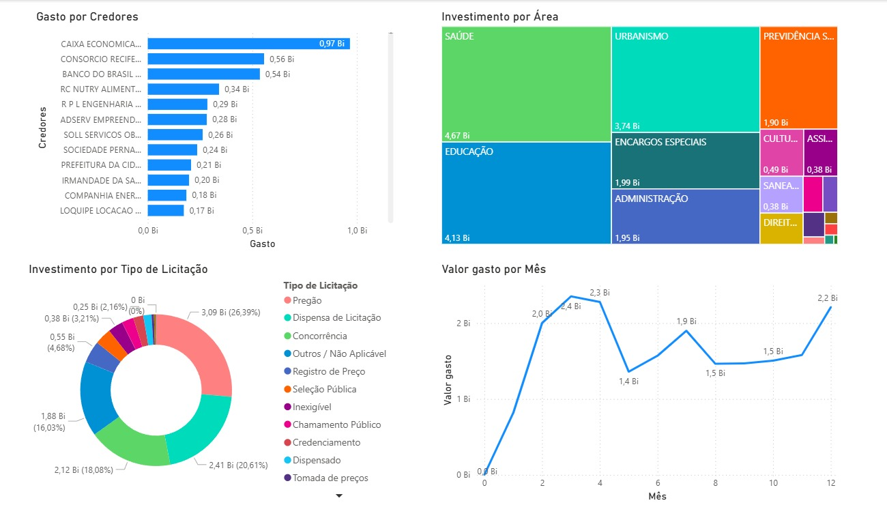
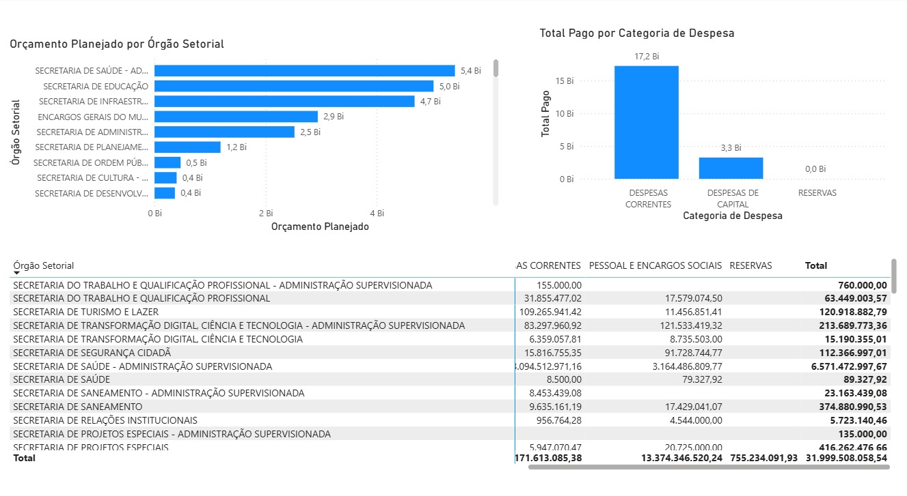

# Auditoria Orcamentaria - Prefeitura do Recife (2024-2026)

## Sobre o Projeto

Este projeto analisa a execucao orcamentaria da Prefeitura do Recife entre 2024 e 2026, usando dados publicos do Portal da Transparencia. A proposta e acompanhar o dinheiro publico desde a dotacao orcamentaria ate os valores empenhados, liquidados e pagos.

A analise busca responder perguntas como:

- Onde a prefeitura concentra a maior parte dos recursos?
- Quais orgaos executam os maiores volumes de pagamento?
- Quais credores recebem os maiores valores?
- O planejamento orcamentario esta sendo executado como previsto?
- Existem sinais de alerta, como concentracao de pagamentos, baixa execucao ou diferencas relevantes entre empenhado e pago?

## Tecnologias e Ferramentas

- **MySQL:** criacao das tabelas, importacao dos CSVs, tratamento dos dados e criacao de views.
- **SQL:** consultas analiticas, verificacoes de qualidade e investigacoes de auditoria.
- **Python:** geracao de indicadores de anomalia para apoiar auditoria.
- **Machine Learning:** deteccao de registros atipicos por credor e orgao.
- **Power BI:** construcao do dashboard interativo.
- **Dados publicos:** arquivos extraidos do Portal da Transparencia da Prefeitura do Recife.

## Estrutura do Projeto

```text
dashboard/
  dashboard_auditoria_recife.pbix
data/
  credor_empenho_2024.csv
  credor_empenho_2025.csv
  credor_empenho_2026.csv
  despesa_funcional_2024.csv
  despesa_funcional_2025.csv
  despesa_funcional_2026.csv
  despesas_orgao_2024.csv
  despesas_orgao_2025.csv
  despesas_orgao_2026.csv
  ml_audit_flags.csv
img/
  parte1.jpeg
  parte2.jpeg
scripts/
  01_create_tables.sql
  02_import_data.sql
  03_transform_data.sql
  04_analytics_queries.sql
  05_data_quality_checks.sql
  ml_anomaly_detection.py
data_dictionary.md
insights.md
readme.md
requirements.txt
```

## Metodologia

O trabalho foi organizado em seis etapas:

1. **Coleta dos dados:** uso dos arquivos CSV de despesas por orgao, despesa funcional e credor/empenho.
2. **Modelagem:** criacao de tabelas para receber os dados brutos no MySQL.
3. **Carga:** importacao dos arquivos com `LOAD DATA LOCAL INFILE`.
4. **Tratamento:** criacao de views com limpeza de textos e conversao de valores monetarios.
5. **Analise:** consultas SQL e dashboard Power BI para avaliar execucao, concentracao e sinais de auditoria.
6. **Machine learning:** geracao de score de anomalia por credor, orgao e ano.

## Dashboard





## Scripts SQL

- `01_create_tables.sql`: cria o banco e as tabelas de apoio.
- `02_import_data.sql`: importa os CSVs para o MySQL.
- `03_transform_data.sql`: cria views tratadas para analise.
- `04_analytics_queries.sql`: concentra consultas de analise orcamentaria.
- `05_data_quality_checks.sql`: verifica qualidade, completude e consistencia dos dados.
- `ml_anomaly_detection.py`: gera o arquivo `data/ml_audit_flags.csv` com scores de anomalia.

## Como Executar

1. Clone ou baixe este repositorio.
2. Abra o MySQL e execute `scripts/01_create_tables.sql`.
3. No arquivo `scripts/02_import_data.sql`, substitua `caminho/do/diretorio/data/` pelo caminho absoluto da pasta `data` no seu computador.
4. Execute `scripts/02_import_data.sql`.
5. Execute `scripts/03_transform_data.sql`.
6. Execute `scripts/05_data_quality_checks.sql` para validar a carga.
7. Execute `scripts/04_analytics_queries.sql` para consultar os indicadores.
8. Opcionalmente, instale as dependencias Python com `pip install -r requirements.txt`.
9. Execute `python scripts/ml_anomaly_detection.py` para gerar `data/ml_audit_flags.csv`.
10. Abra `dashboard/dashboard_auditoria_recife.pbix` no Power BI e atualize a conexao com o MySQL.

## Principais Analises

- Eficiencia orcamentaria por ano.
- Ranking dos orgaos com maior pagamento.
- Ranking de funcoes com maior execucao.
- Maiores credores da prefeitura.
- Concentracao de pagamentos por credor.
- Orgaos com baixa execucao de pagamento.
- Diferenca entre valores empenhados e pagos.
- Evolucao mensal dos pagamentos.
- Score de anomalia por credor, orgao e ano.

## Limitacoes

- A analise depende da qualidade e atualizacao dos dados publicados no portal.
- O ano de 2026 pode estar parcial, dependendo da data de extracao dos arquivos.
- Sinais encontrados por SQL indicam pontos de atencao, mas nao comprovam irregularidade sem analise documental.
- O score de machine learning indica comportamento atipico, mas tambem nao comprova irregularidade sozinho.
- Alguns campos textuais dos CSVs podem exigir cuidado com encoding dependendo do ambiente.

## Documentacao Complementar

- `data_dictionary.md`: descreve arquivos, tabelas, campos e indicadores.
- `insights.md`: registra interpretacoes e possiveis linhas de investigacao.
